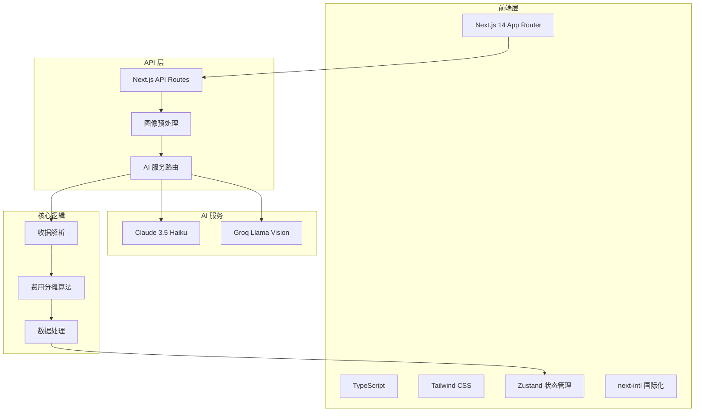

# AAPay 智能费用分摊

[](https://opensource.org/licenses/MIT)
[](https://nextjs.org/)
[](https://www.typescriptlang.org/)
[](https://vercel.com)
[](https://www.anthropic.com)


基于 Next.js 全栈架构的现代化费用分摊应用，利用 AI 图像识别技术自动解析收据，智能计算每个人的应付金额。支持税费、小费按比例分摊，让每个人都支付公平的份额。

## 🎯 在线体验

**🚀 [立即体验 Demo](https://aapay.amoy.day)**

<div align="center">
  
  <p><em>扫码用手机体验</em></p>
</div>

## ✨ 功能特性

### 🤖 AI 智能识别

| 功能 | 描述 | 状态 |
|------|------|------|
| **多服务支持** | Claude 3.5 Haiku (高精度) / Groq Llama Vision (高速度) | ✅ |
| **格式支持** | JPG, PNG, GIF, WebP, HEIC/HEIF 自动转换 | ✅ |
| **客户端优化** | 上传前图片压缩，提升识别速度 | ✅ |
| **智能提示** | 根据用户语言环境使用不同提示语 | ✅ |
| **OCR 备选** | 离线 OCR 识别（计划中） | 🔄 |

### 💰 智能分摊计算

| 功能 | 描述 | 状态 |
|------|------|------|
| **按比例分摊** | 税费、小费按商品价格比例精确分摊 | ✅ |
| **多人共享** | 单个商品可分配给多人，费用自动平均分摊 | ✅ |
| **多账单处理** | 一次性处理多张收据，汇总最终账单 | ✅ |
| **货币换算** | 多币种支持（计划中） | 🔄 |

### 📱 现代化用户体验

| 功能 | 描述 | 状态 |
|------|------|------|
| **响应式设计** | 完美适配桌面和移动设备 | ✅ |
| **渐进式操作** | 分步流程引导，简单清晰 | ✅ |
| **国际化** | 中文、英文双语支持 | ✅ |
| **PWA 支持** | 离线使用、添加到主屏幕（计划中） | 🔄 |

## 🏗️ 技术架构



### 技术栈详情

**前端**
- **框架**: Next.js 14 (App Router)
- **语言**: TypeScript
- **状态管理**: Zustand
- **样式**: Tailwind CSS
- **国际化**: next-intl
- **图标**: Lucide React

**后端**
- **API**: Next.js API Routes
- **AI 集成**: Anthropic Claude, Groq
- **图像处理**: browser-image-compression, heic-convert

**核心模块**
- `src/lib/aiService.ts`: AI 服务客户端逻辑
- `src/app/api/.../route.ts`: 服务器端 AI 请求路由
- `src/lib/dataProcessor.ts`: 费用分摊核心业务逻辑
- `src/store/index.ts`: 全局状态管理

## 🚀 快速开始

### 环境要求
- Node.js 18+
- npm 或 yarn

### 一键安装

```bash
# 克隆项目
git clone https://github.com/ljnpng/aapay.git
cd aapay

# 安装依赖
npm install

# 复制环境变量模板
cp .env.example .env

# 启动开发服务器
npm run dev
```

应用将在 `http://localhost:3000` 启动，并自动在浏览器中打开。

<details>
<summary>📋 .env 配置示例</summary>

```bash
# --- 环境变量 ---

# AI 服务提供商 (claude 或 groq, 默认为 claude)
AI_PROVIDER=claude

# Claude API 密钥 (使用 claude 时必需)
CLAUDE_API_KEY=your_claude_api_key_here

# Groq API 密钥 (使用 groq 时必需)
GROQ_API_KEY=your_groq_api_key_here
```

</details>

## 📜 脚本命令

| 命令 | 说明 | 使用场景 |
|------|------|----------|
| `npm run dev` | 启动开发服务器，自动打开浏览器 | 本地开发 |
| `npm run build` | 构建生产版本 | 部署前检查 |
| `npm start` | 启动生产服务器 | 生产环境运行 |
| `npm run lint` | 运行 ESLint 检查 | 代码质量检查 |
| `npm run test:ai` | 测试 AI 服务连接 | 调试 AI 服务 |

### 测试 AI 服务

```bash
# 测试默认 (claude) AI 服务
npm run test:ai

# 测试 Groq 服务
AI_PROVIDER=groq npm run test:ai
```

## 🔧 环境变量说明

| 变量名 | 类型 | 必填 | 默认值 | 作用域 | 说明 |
|--------|------|------|--------|--------|------|
| `AI_PROVIDER` | string | 否 | `claude` | server | AI 服务提供商选择 |
| `CLAUDE_API_KEY` | string | 条件 | - | server | Claude API 密钥 |
| `GROQ_API_KEY` | string | 条件 | - | server | Groq API 密钥 |

**获取 API 密钥**：
- **Claude**: [Anthropic Console](https://console.anthropic.com/)
- **Groq**: [Groq Console](https://console.groq.com/)

## 🔀 开发工作流

### Git 分支策略
- `main`: 生产分支
- `develop`: 开发分支
- `feat/*`: 新功能分支
- `fix/*`: 错误修复分支
- `chore/*`: 杂务分支

### Commit 规范
遵循 [Conventional Commits](https://www.conventionalcommits.org/zh-hans/v1.0.0/) 约定：

```bash
feat: 添加新功能
fix: 修复 bug
docs: 文档更新
style: 代码格式化
refactor: 重构代码
test: 添加测试
chore: 构建、工具链更新
```

## 🧪 测试指南

### 单元测试
```bash
# 运行所有测试
npm test

# 运行特定测试
npm test -- --testNamePattern="dataProcessor"

# 生成覆盖率报告
npm run test:coverage
```

### 集成测试
```bash
# 测试 AI 服务集成
npm run test:ai

# 测试图像处理
npm run test:image-processing
```

### Mock AI API
```javascript
// tests/mocks/ai-service.mock.js
export const mockAIResponse = {
  items: [
    { name: "商品1", price: 10.99 },
    { name: "商品2", price: 15.50 }
  ],
  subtotal: 26.49,
  tax: 2.12,
  tip: 5.30,
  total: 33.91
};
```

## 🚀 部署文档

### Vercel 部署

项目已为 Vercel 平台高度优化，支持无缝部署。

1. **Fork 项目** 到你的 GitHub 账户
2. 在 Vercel Dashboard 中，点击 "Add New... -> Project"
3. 选择你刚才 Fork 的 GitHub 仓库并导入
4. **配置环境变量**：
   在项目设置的 "Environment Variables" 中，添加以下变量：
   - `AI_PROVIDER`
   - `CLAUDE_API_KEY`
   - `GROQ_API_KEY`
5. 点击 "Deploy"，Vercel 将自动完成构建和部署

### 自动化部署
- 推送到 `main` 分支将自动触发生产部署
- 推送到其他分支将创建预览部署
- 支持自定义域名和 SSL 证书
- 内置 CI/CD 流水线和性能监控

## 🌐 国际化指南

### 添加新语言

1. 在 `src/messages/` 目录下创建新的语言文件：
   ```bash
   # 例如添加法语
   cp src/messages/en.json src/messages/fr.json
   ```

2. 更新 `i18n.ts` 配置：
   ```typescript
   export const locales = ['en', 'zh', 'fr'] as const;
   ```

3. 翻译 JSON 文件中的所有字符串

### 翻译流程
1. 使用 `extract-messages` 脚本提取新的翻译键
2. 更新各语言的 JSON 文件
3. 本地测试不同语言
4. 提交 PR

## 🔒 安全与合规

### 隐私保护
- ✅ **图片不存储**：所有收据图片仅在内存中处理，不会保存到服务器
- ✅ **API 密钥保护**：所有 AI 服务调用在服务器端完成，密钥不暴露
- ✅ **数据本地化**：所有计算数据仅在浏览器本地存储

### GDPR 合规
- 数据最小化原则
- 用户数据可删除
- 透明的隐私政策

### 最佳实践
- 定期轮换 API 密钥
- 使用环境变量管理敏感信息
- 启用 HTTPS 传输加密

## ❓ 常见问题

### 🔧 技术问题

<details>
<summary><strong>Q: AI 识别返回错误？</strong></summary>

**可能原因**：
1. API 密钥未正确设置
2. AI_PROVIDER 与密钥不匹配
3. 服务商账户余额不足
4. 网络连接问题

**解决方案**：
1. 检查 `.env` 文件中的密钥配置
2. 确认 `AI_PROVIDER` 值正确
3. 查看服务商账户状态
4. 运行 `npm run test:ai` 进行诊断
</details>

<details>
<summary><strong>Q: HEIC 图片处理很慢？</strong></summary>

**原因**：HEIC 格式需要在服务器端进行格式转换，比 JPG/PNG 耗时更长。

**优化建议**：
1. 优先使用 JPG/PNG 格式
2. 在相机设置中关闭 HEIC 格式
3. 使用图片压缩工具预处理
</details>

### 🎯 使用问题

<details>
<summary><strong>Q: 识别结果不准确怎么办？</strong></summary>

**优化建议**：
1. 确保收据图片清晰、完整
2. 避免折叠、反光
3. 切换到 Claude 服务（精度更高）
4. 手动编辑识别结果
</details>

<details>
<summary><strong>Q: 支持哪些收据类型？</strong></summary>

**支持类型**：
- ✅ 餐厅收据
- ✅ 超市小票
- ✅ 发票
- ✅ 手写账单
- ❌ 非结构化文本
</details>

## 🤝 贡献指南

欢迎所有形式的贡献！请查看 [CONTRIBUTING.md](docs/CONTRIBUTING.md) 了解详细信息。

### 贡献类型
- 🐛 Bug 报告
- 💡 功能建议
- 🔧 代码贡献
- 📝 文档改进
- 🌐 翻译支持

### 快速开始贡献

1. **Fork 项目**
2. **创建特性分支**：`git checkout -b feat/amazing-feature`
3. **提交更改**：`git commit -m 'feat: 添加了令人惊叹的功能'`
4. **推送分支**：`git push origin feat/amazing-feature`
5. **创建 Pull Request**

### 代码规范
- 使用 TypeScript
- 遵循 ESLint 配置
- 提交前运行 `npm run lint`
- 编写单元测试

## 🌟 社区与支持

### 交流渠道
- 📧 **邮箱**：support@aapay.app
- 💬 **GitHub Discussions**：[讨论区](https://github.com/ljnpng/aapay/discussions)
- 🐛 **Bug 报告**：[Issues](https://github.com/ljnpng/aapay/issues)

### 获取帮助
- 查看 [FAQ](#常见问题) 部分
- 搜索 [GitHub Issues](https://github.com/ljnpng/aapay/issues)
- 在 [Discussions](https://github.com/ljnpng/aapay/discussions) 中提问

### 发布说明
- 查看 [Releases](https://github.com/ljnpng/aapay/releases) 了解版本更新
- 关注 [Changelog](CHANGELOG.md) 获取详细变更记录

## 📄 许可证

本项目采用 [MIT 许可证](LICENSE) 开源。

---

<div align="center">
  <p>如果这个项目对你有帮助，请给我们一个 ⭐️ 支持！</p>
  <p>Made with ❤️ by <a href="https://github.com/ljnpng">ljnpng</a></p>
</div>
